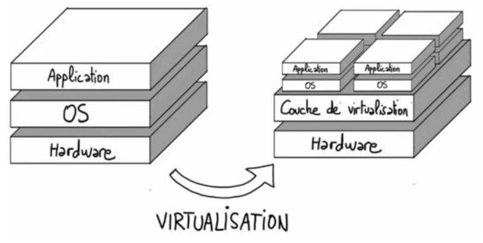
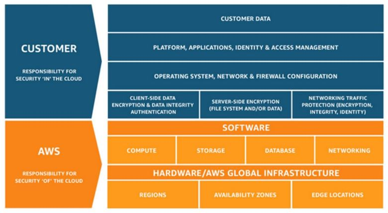
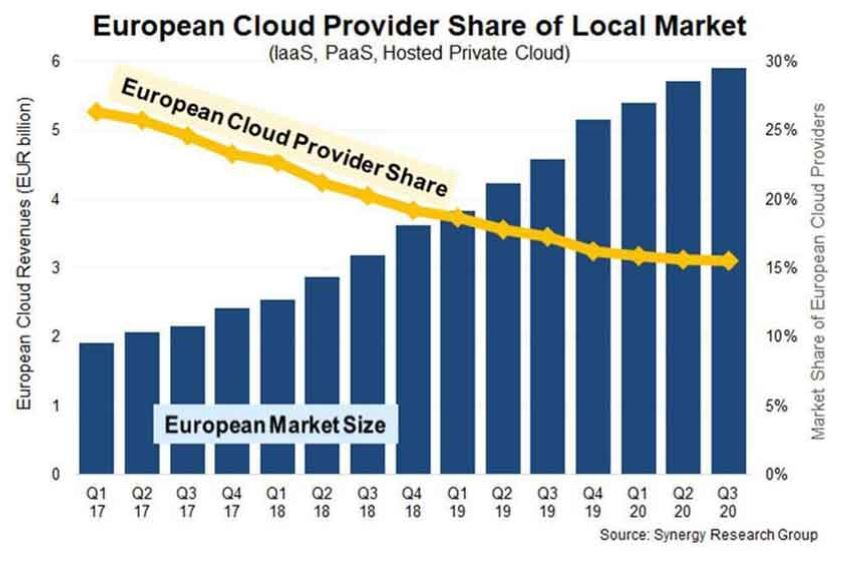

# Stratégie de migration du SI sur le Cloud

## Virtualisation

## Qu'est ce que le Cloud ?

* Espace virtuel

* Accès en ligne, à la demande et en libre service

* Ressources informatiques partagées et configurables

* Mutualisation de de ressources de stockage et de calcul

* Mutualisation de la maintenance

* Facturation à l’usage, en fonction des besoins

## Type de Solutions

* IaaS : Infrastructure as a Service

* Paas : Plateform as a Service

* SaaS : Software as a Service

## Pourquoi migrer

* Répondre aux nouveaux enjeux business et à la pression des directions métiers ;

* Gagner en agilité, réactivité, flexibilité et time-to-market, déploiement à l’échelle ;

* Bénéficier des nouvelles technologies, services packagés et notamment pour les données ;

* Obtenir une couverture mondiale et une réplication géographique ;

* Harmoniser et centraliser des systèmes permettant des économies d’échelle ;

* Sécuriser ses systèmes d’information ;

• Réduire la dette technique par l'utilisation des services managés et d’outils d'automatisation proposés par les fournisseurs cloud ;

* Rationaliser ses datacenters et ses infrastructures ;

* S’adapter à une variabilité du business (pics et creux d’activité) ;

* Promouvoir de nouvelles méthodes de travail des équipes IT agiles ;

* Bâtir des business plateformes et ouvrir des potentialités d’innovation.

## Les freins

* Compréhension des dirigeants des enjeux du cloud ;

* Exigences réglementaires (OIV) ;

* Exposition aux lois extraterritoriales lors du choix d’un fournisseur international ;

* Confidentialité des données de l’entreprise ;

* Protection des secrets technologiques et industriels ;

* Performance économique attendue ;

* Cloudification des systèmes critiques (ex : SI industriel) ;

* Investissement nécessaire (temps, moyens, ressources) pour des gains encore à démontrer ;

* Arbitrage et priorisation des projets ;

* Déséquilibre dans les relations avec certains grands fournisseurs ;

* Maturité interne de l’organisation : ressources humaines, compétences.

## Les questions à se poser

* Application v/s données

* Pertinence ? (encaissement des hypermarchés)

* Ratio données sensibles / ensemble

* Capacité à intégrer des compétences pointues

* Obsolescence de l’infrastructure

* Enjeux de sécurité grandissants

* Exigences environnementales

## Stratégie de migration

## Privé v/s publique

* Cloud Privé interne : Technologie cloud dans un datacenter de l’entreprise

* Cloud Privé externalisé :  Fournisseur externe sans mutualisation

* Cloud Public : Fournisseur externe avec mutualisation

## Enjeux du multicloud

* 80% des organisations

* Interopérabilité et portage difficile et coûteux

* Pas dans l’intérêt des fournisseurs

* Choix du fournisseur structurant

* Stratégies de verrouillage (OVH v/s Microsoft)

## Migration applicative

1. Faire l’inventaire de toutes les applications du SI sur la base de critères définis ;

2. Filtrer les applications qu’il ne faut pas évaluer ou migrer ;

3. Evaluer les applications à migrer sur la base de 4 critères : Stratégique, Technologique, Complexité, Risque ;

4. Revoir les résultats de l’évaluation dans un quadrant de priorisation ;

5. Elaborer une feuille de route cohérente pour la DSI et l’entreprise.

## options de transformation

Le plus commun : lift and shift
Réel avantage en transformant

• Minimum d’efforts :
    o Lift and shift : est l’action de migrer l’application telle quelle.
    o Rehost : correspond au « lift and shift » avec un minimum de remédiation du système d’exploitation et des bases de données de l’application.
• Modification de la couche technique :
    o Replateform : permet de remplacer le niveau bas de l’application (qui correspond au passage vers PaaS).
    o Redeploy : correspond au redéploiement de l’application sur une nouvelle plateforme technique.
• Réécriture de l’application :
    o Rearchitect : touche au code de l’application, avec un passage en Continuous Integration and Continuous Delivery (CICD) par exemple (sorte d’équivalent aussi du refactoring ou du rewriting).
• Remplacement :
    o Replace : correspond à la mise en place d’une alternative.
    o Repurchasing : correspond aussi à l’achat de nouvelles solutions sur le marché.
• Conservation (retain) équivaut au maintien de l’application avec une consolidation des environ-nements.
• Décommissionnement (retire) : permet de se séparer de l’application.

## Mutation des équipes IT

* Nouveaux métiers

* Transformations d’autres

* Accompagnement des équipes

* Redéfinition des responsabilités

* Accompagnement au changement

* Test & learn

* Montée en compétence

* Maintenir l’attractivité des postes

* Compléter les équipes (DevOps, SecOps, FinOps)

* Passer de support à conseil

* Garantir la sécurité des données hors-site

### Type de métiers

* DevOps : intervient sur la chaine d’architecture continue, intègre les applications et automatise le déploiement de l’application de bout en bout.

* Ingénieur Sécurité Cloud ou SecOps : met en place la sécurité dans les environnements cloud.

* FinOps : agrège les informations de consommation données par les fournisseurs cloud, les analyse et cherche les leviers d’action pour maîtriser les coûts.

* “Développeur” d’infrastructure (Infrastructure as Code) : code l’infrastructure et définit les technologies à utiliser et les spécifications de l’architecture.

* Ingénieur DevSecOps (ou SRE) : intègre la sécurité dans les pratiques DevOps.

* Evangéliste Cloud : crée un story telling pour vulgariser la complexité du cloud et expliquer son utilisation dans l’entreprise, joue un rôle essentiel au début du programme pour l’adoption.

* Architecte Cloud : crée et intègre l’infrastructure cloud, élabore des solutions en réponse aux besoins des utilisateurs et gère la migration vers des solutions dans le cloud.

* CloudOps : consiste à orchestrer les spécificités des différents fournisseurs cloud, à contrôler le fonctionnement des applications dans différents clouds et permet la gestion des opérations au travers des diverses plateformes cloud.

## Responsabilité

## Fournisseurs

* AWS (51.3%)

* Azure (23.2%)

* Google Cloud (9%)

## Référentiel Cloud de Confiance

* Sécurité

* Réversibilité

* Interopérabilité, Portabilité

* Immunité

* RGPD

GAIA-X : Initiative européenne privée soutenu par l'UE visant à créer un marketplace européen proposant des standards pour la création de services cloud et d’espace de données mutualisés respectant les exigences du Cloud de Confiance

## Retex Entreprises

### Amadeus

* 50% du trafic mondial du voyage en 2019

* 100 000 transactions par secondes

* Niveau de service exigé de 99.95 à 99.99%

* Exigence clientèle de localisation des données

* Partenariat avec Microsoft en 2020

### Sodexo

* Organisation décentralisée

* Entité multiples, diverses et autonomes

* Objectif : Recentraliser et standardiser

* État des lieux du parc et des applicatifs à décommissionner

### PSA

* Bénéficier de la couverture mondiale du Cloud

* Gagner en agilité, flexibilité et en “time to market”

* Équipe pluridisciplinaire

* Comité mensuel

* Points réguliers avec les fournisseurs de Cloud

