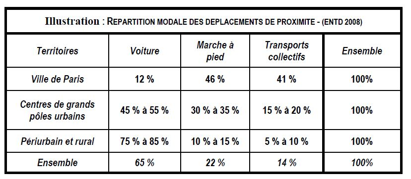
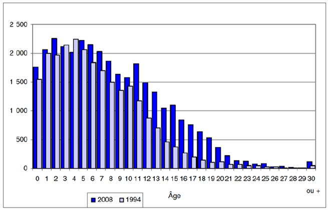
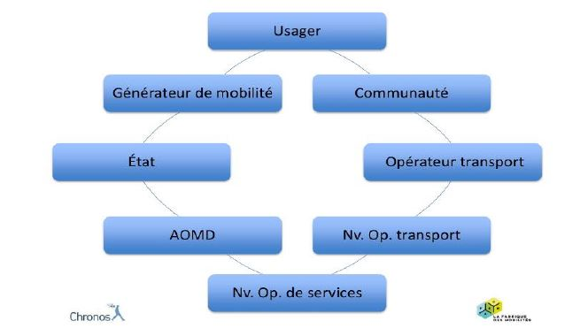
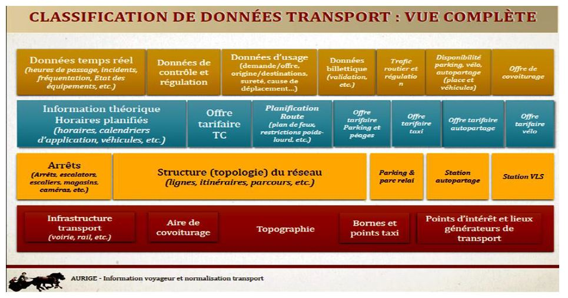
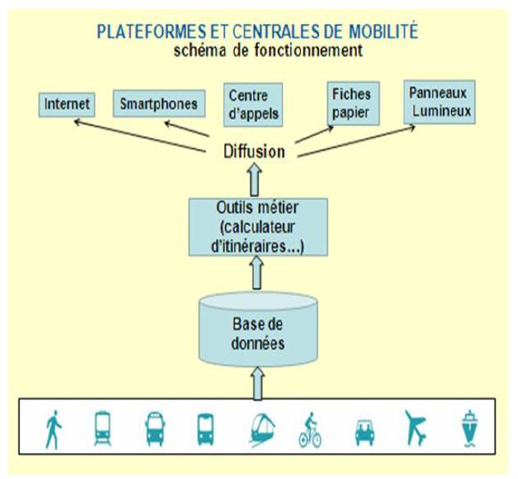

# LA MOBILITÉ REFONDÉE AVEC LE numérique

## Synthèse

### La mobilité est bouleversée par l’irruption des technologies numériques dans les modes de vie

- La mobilité bouleverse déjà nos modes de vie : e-commerce, auto-partage, télétravail, agiradom
- La mobilité est moyen d'accès et résulte d'une activité 
- Le numérique apporte des évolutions des déplacements physiques : véhicule autonome, culture du partage, connexxions multimodales, optimisation d'usage des infrastructures
- Culture du partage : information (ex : coyote), véhicule (ex: blablacar), logement (ex: airbnb) ...
- Encore plus importante pour les jeunes générations pour qui le numérique fait partie par défaut de leur usages 
- Les modes de vie sont les "traceurs" des dynamiques de transformation des activités humaines 
- Rapport Lemoine (2014) : l'homme passe de consommateur à acteur sous l'effet de la révolution numérique 

### Le numérique conduit à penser autrement les transformations des mobilités, à partir des modes de vie

- Les mobilités innovantes portées par le numérique s’imbriqueront dans la réalité des activités quotidiennes
- C'est la nature même de l'activité de l'utilisateur (travailleur, promeneur, consommateur ...) qui génère le besoin de mobilité
- Avec l’arrivée des nouveaux acteurs et des plateformes d’information numériques, chacun peut expérimenter et acquérir de l’expérience.
- Repenser la mobilité dans les territoires, en co-construction avec les usagers 
- Apprentissage de l'utilisation par l'expérimentation

### Le mouvement de transformation des mobilités est déjà largement engagé

- La progression du transport de personnes s’est nettement ralentie depuis une dizaine d’années, avec une quasi-stagnation de la circulation automobile.
- L’attente des citoyens n’est pas d’augmenter leurs kilomètres parcourus, mais d’améliorer les conditions d’accès à leurs activités quotidiennes ou occasionnelles avec des déplacements plus vertueux.
- Moins long, plus fiable, plus sûrs, plus écologiques, moins couteux, voir sans déplacements.
- L’irruption des acteurs du numérique bouscule les acteurs historiques du transport et contourne les modèles établis.
- Les Google, Waze, Coyotte, Moovit, Uber, BlaBlaCar… remettent en cause nos organisations historiques, menacent nos emplois, et accentuent la fracture sociale et générationnelle.

### Des pistes d’action pour une mobilité responsable, intelligente et durable

- Une organisation des modes de vie dans des espaces de proximité
- Une organisation réinventée des systèmes de transport dans les bassins de vie sous la forme de bouquet de services

### Renouveler les modes d’action publique

- Par une politique d’innovation par l’action, le rôle de la collectivité publique est d’abord de mobiliser l’intelligence des citoyens usagers et des organisations collectives de proximité.
- Il appartient ensuite à la collectivité d’organiser les systèmes d’information pour la mobilité en tant que « biens communs » - au sens économique et environnemental - bénéficiant d’un statut et de règles d’usage spécifiques.
- La gouvernance territoriale devra s’assurer de la bonne utilisation des biens communs.
- Enfin, l’Etat devra à la fois promouvoir l’innovation et garantir la solidarité.

## Introduction

Le concept de mobilité désigne les aptitudes et les possibilités des personnes d’accéder à leurs activités quotidiennes ou occasionnelles en utilisant différents modes de déplacement, voire l’absence de déplacement lorsque l’activité est accessible au lieu où elles se trouvent.

Il englobe transports et leurs combinaisons, ainsi que les services immatériels (localisation, itinéraire, horaire, correspondance, billetique ...).

Comme l'automobile ou l'avion, le numérique bouleversera la mobilité.

## Du transport à la mobilité : le numérique conduit à considérer la mobilité par sa finalité (accéder aux activités avec ou sans déplacement)

### Le numérique omniprésent dans nos sociétés du XXIème siècle

#### Le numérique façonne d’ores et déjà nos modes de vie par de nouvelles solutions qui couvrent autrement les besoins de mobilité.

- Le commerce à distance, le compteur d’énergie intelligent, la voiture partagée, la santé à domicile, la formation assistée, le travail mobile…
- Le numérique rend accessible des grandes masses d'information, n'importe quand et de n'importe où

#### Les modes de vie sont les « traceurs » des dynamiques de transformation des activités humaines

- Le citoyen-client-utilisateur est au coeur de ces processus de transformation
- la course technologique n’est plus tirée par les entreprises ou les grandes organisations, ce sont les personnes qui font la course en tête
- les impacts deviennent réellement transversaux, avec des changements qui concernent aussi bien l’industrie que les services, le bâtiment ou l’agriculture, que l’accès à la connaissance, l’expression culturelle ou la santé
- l’incidence de la technologie sur l’économie se diversifie et se complexifie, avec trois effets : les effets d’automatisation qui transforment les processus de production industrielle ; les effets de dématérialisation où l’internet se substitue aux réseaux physiques d’agences, de guichets et de magasins ; et les effets d’intermédiation/désintermédiation sur les modèles économique, avec l’enjeu de la donnée, comme ressource pour réinventer les métiers existants.

#### Le numérique peut transformer l’organisation des villes et des territoires

- Le numérique révolutionne l'organisation des activités humaines, et donc l'organisation des territoires
- Il permet à la fois de mutualiser les ressources - l’espace, l’énergie, les services -, de gérer les temporalités, de gommer les distances, de redonner l’initiative aux habitants connectés en permanence …
- Lorsque chacun dispose à tout instant d’informations personnalisées et directement utilisables, les rapports au temps et à l’espace évoluent.
- A la culture de la vitesse permettant d’accéder à des destinations plus nombreuses ou plus éloignées (ce qui, au cours des dernières décennies, a conduit à l’étalement urbain, à la recomposition des territoires et au changement des modes de vie), se substitue une culture du temps utile et partagé pour organiser les activités de la vie quotidienne : dès qu’elles le peuvent, les nouvelles générations connectées pratiquent le travail mobile plutôt que de de faire deux heures de transport par jour pour accéder à un bureau et se connecter à un ordinateur…

### Le numérique ouvre de nouveaux champs à la mobilité

#### Le numérique porte des perspectives d’évolution des déplacements physiques importantes et encore peu explorées

- Une plus grande efficacité des transports collectifs : l’information sur les flux pour mieux organiser la réponse aux pointes de trafic (y compris par une tarification modulée) ; l’informatisation des modes de régulation pour optimiser l’usage de l’infrastructure ; l’attractivité par la régularité, l’accroissement de la vitesse et une meilleure gestion des incidents ; de moindres coûts de gestion et de distribution des titres de transport ; une clarification du partage tarifaire entre opérateurs.
- Une meilleure conception et utilisation de l’automobile : progrès pour la consommation d’énergie, le confort et la sécurité ; interface entre Smartphone, véhicule et route, utile pour optimiser infrastructures et investissements publics (meilleur taux de remplissage, fluidification du trafic, baisse de la congestion).
- La mise en synergie des modes de transport. Afin de tirer parti de leurs diverses qualités, les collectivités favorisent ainsi de nouvelles solutions sous plusieurs formes : intégration d’autopartage dans leur offre de mobilité, exploitée par des opérateurs privés. Plans de déplacements d’entreprises et interentreprises. Intégration dans le passe mobilité de nouveaux services favorisant la multimodalité.
- L’automobile partagée, sous différentes formes de covoiturage et d’autopartage. Elle apporte des réponses pour réduire les inégalités dans la desserte des territoires (périurbain et rural) en complément des solutions de mobilité dans ces territoires où la voiture individuelle est quasiment le seul moyen de transport.
- La limitation de la congestion routière. Réduire les émissions de gaz à effet de serre qu’elle génère - en évitant des déplacements aux heures de pointe, soit par un étalement organisé des horaires de travail (dans le cadre de plans de déplacement d’entreprises ou interentreprises), soit par le développement du télétravail et la mise à disposition de tiers lieux Le développement des usages partagés (covoiturage, autopartage, vélo en libre-service…) a le même effet ; il permet d’augmenter le taux d’occupation des véhicules, d’en réduire le nombre et de libérer de l’espace sur la chaussée.

#### La mobilité est le principal champ de développement de la ville intelligente et connectée

- La ville et le territoire intelligents sont avant tout des espaces d’interactions avec les usagers,
- Réfléchir globalement et plus en silos, penser les infrastructures comme des services
- Les villes intelligentes sont conçues en logique de réseau

### Comprendre la mobilité comme accès et résultante d’une activité

#### Une même finalité : permettre à chacun l’accès aux activités de la vie quotidienne. Et donc sur une nouvelle façon pour chacun d’être mobile…

- le déplacement d'un individu est le moyen d'accéder à différentes activités
- il organise sa mobilité en combinant numérique, proximité et déplacement

#### Les modes de vie au coeur de la compréhension des mobilités dans les territoires

Ce sont donc les activités exercées dans les territoires qui façonnent et composent nos modes de vie et génèrent nos besoins de mobilité :
- l’agencement des villes : formes urbaines, densités, lieux de rencontre… ;
- la localisation des personnes et des services : habitat, bureaux, lieux de production, distribution, commerces, services de transport…;
- les rites et les rythmes d’organisation quotidienne des personnes et des activités : emplois du temps, flux d’échanges, manifestations collectives…

## Les modèles et les acteurs : impact des nouveaux acteurs sur l'automobile et le transport collectif

### Un système actuel cloisonné entre voiture individuelle et transport collectif

#### La croissance historique de la mobilité a été tirée par les progrès technologiques des moyens de transport

- taux de possession de voiture par ménage multiplié par 10 entre 1955 et 2005 
- étalement urbain, activité en périphérie des villes (centres commerciaux, zones industrielles et administratives), habitat dispersé
- distance moyenne quotidienne : 16.3km en 1973, 35.5 en 1994
- budget-temps transport stable, allongement des distances compensé par l'augmentation de la vitesse de déplacements
- forte croissance des déplacements de loisirs et de tourisme 
- ce mode de croissance n'est plus soutenable au 21e siècle

#### Le développement du transport collectif et ses limites

- le développement des trasports collectifs classiques atteint ses limites
- indispensable dans les territoires dense, peu pertinent dans le rural et le périurbain
- hors zone dense ou liaisons entre les grandes agglos, l'empreinte environnementale des transports publics est supérieure à celle de voiture correctement occupées

#### La place dominante du transport individuel automobile

- Pour la majorité des trajets domicile travail, les solutions alternatives à l’automobile sont quasiment inexistantes dans les zones peu denses et les petites agglomérations.

### Une évolution qui souligne l’inadaptation des modèles actuels

#### Les moteurs historiques de la croissance de la mobilité ne fonctionnent plus

En France, la stagnation de la circulation automobile s'explique par :
- une activité touristique plus diversifiée (les revenus modestes prenne moins de vacances, et les autres font plus de séjour à distance)
- tassement des déplacements de proximité, lié au coût d'usage de l'automobile
- regain d'usage des transports collectifs dans les grandes agglos (l'offre s'est développée, accompagnée de restriction de circulation ou de stationnement)

#### Un écart qui se creuse entre les territoires denses desservis en transports collectifs et les autres

Zones urbaines denses :
- concentration des activités et services
- 30 à 35% de déplacement à pied 
- développement des transports collectifs 
- les ménages limitent l'usage de la voiture et leur motorisation diminue 

Zones faiblement urbanisés et rurales :
- posséder un véhicule est une nécessité
- marche à pied anecdotique
- moins de 6% des déplacements en transports collectifs
- les contraintes de budgets amène les ménages à limiter le renouvellement de leur véhicules

#### Un parc automobile vieillissant et faiblement utilisé

- parc vieillissant, à faible taux de renouvellement et sous-utilisé
- les émissions du parc ne diminuent que de 1% par an
- kilométrages globaux stables 
- démotorisation des ménages pas vraiment amorcée 
- l'adaptation des véhicule aux modes de vie n'est pas engagé, ni par les constructeurs, ni par les autorités

#### Un changement de paradigme : l’objectif n’est plus d’augmenter la mobilité, mais d’en améliorer les conditions

La consommation du transport atteint son niveau de maturité :
- les distances de déplacements domicile-travail restent élevées, mais n’augmentent plus ;
- les vitesses de transport porte à porte diminuent, notamment avec la congestion ;
- les distances de déplacements quotidiens restent contraintes par les rythmes de vie et les durées de transport.
- les populations aux revenus supérieurs ont « fait le plein » de leurs envies de déplacement, mais il reste des potentialités de croissance issues des populations à faible revenu actuel…

l’aspiration à des déplacements de la vie quotidienne :
- moins longs, notamment pour accéder au travail et aux services essentiels : la santé, la formation et la culture, la rencontre et l’échange ;
- plus fiables et plus sûrs, pour éviter la congestion des routes, les temps attentes, l’encombrement des transports collectifs… ;
- plus économes, pour limiter les consommations d’énergies polluantes et non renouvelables ;
- moins couteux pour les usagers comme pour les contribuables.

Si le kilométrage parcouru n'augmente plus, l'accessibilité parait s'améliorer, grâce au numérique.

### L’irruption des acteurs du numérique rebat les cartes

#### Avec les nouveaux acteurs du numérique, le processus d’adaptation des mobilités, couplé à des objectifs de développement durable, est devenu plus ouvert.

#### L'usager/client, qui adhère ou non aux nouvelles offres de mobilité

L’usager est devenu parallèlement :
- fournisseur de données par les informations qu’il apporte sur ses trajets quotidiens ou occasionnels ;
- coproducteur de solutions de mobilité, par sa collaboration à des services de véhicules partagés, par ses idées sur le fonctionnement des services existants, exprimées directement et via ses réseaux sociaux, ou par ses pratiques d’expérimentations de solutions nouvelles, organisées à l’échelon local ;
- participant au débat public concernant les choix d’urbanisme qui impactent son cadre de vie.

#### Les nouveaux opérateurs de services, devenus incontournables

Google Maps, Waze, Coyotte, Moovit, Uber, BlaBlaCar…
- accumulation massive de données 
- pas de frontière administratives 
- capacité d'adaptation technologique et sociales 

#### Les générateurs de mobilité, creusets d’innovation par l’expérimentation

- Les entreprises, associations et autres communautés d’intérêt peuvent faire évoluer les pratiques de mobilité qu’elles génèrent.
- localisation et horaires du travail, disponibilité des commerces, accès aux services de santé, rythmes scolaires…
- Leurs possibilités d’adaptation est un levier d’action puissant et donc un champ important pour l’innovation.

#### Les modes de gouvernance traditionnels de la mobilité sont à repenser

- politiques fondées sur la plannification qui atteignent leurs limites 
- les opérateurs de transports sont concurrencé par les acteurs du numérique 
- ils sont obligé désormais de construire leur offre à partir de la compréhension fine des besoins et pratiques observées 
- les nouvelles offres de service n'entrainent pas nécessaire l'adhésion des usages qui décident en dernier ressort 
- l'autorité organisatrice n'a plus l'exclusivité des leviers de commande sur la mobilité
- le numérique rend possible les interactions entre les parties-prenantes de la chaîne de mobilité

## Le numérique comme système d’organisation de la mobilité : adaptation de la mobilité (dématérialisation, information, partage)

### L’adaptation des activités génératrices de déplacements

- nouvelles manières de concevoir ces activités (travail mobile, service à distance, relai de proximité)

#### Tous les champs d’activité de la vie quotidienne - travail, commerce, santé, formation…- sont reliés par la mobilité des personnes.

- entreprises, associations, services publics, communautés locales, pôles d’activité : tous peuvent participer à l'organisation des territoires et à la mobilité des personnes

#### Quelques exemples de trajectoires d’adaptation des activités pour organiser « la vie de proximité »

##### Exemple 1 : Une organisation du travail collaborative et agile

- transformation du management : liberté de localisation et d'horaire
- limite nombre et durée des trajets domicile-travail 
- agglo : peut promouvoir l'aménagement de lieux de travail nomade, d'espace de covoiturage, ajuster réglementation et tarif des transports

##### Exemple 2 : Des réseaux de santé de proximité

- couvrir l'essentiel des besoins courants en liaison avec la médecine spécialisée qui devient un 2e recours 

##### Exemple 3 : Des tiers lieux pour activer les compétences individuelles et collectives

- espaces de travail partagés

##### Exemple 4 : Des centres multiservices de proximité

- relai-colis 
- coopération des acteurs territoriaux (la poste ...)

##### Exemple 5 : Le commerce en ligne et le développement des services à domicile

- surcroit d'activité de logistique urbaine (livraison dernier kilomètre)
- espace commerciaux de proximité

### L’accès à des plateformes et centrales d’information

- infrastructure numérique qui distribue les services de mobilité, potentiellement enrichis

#### Disposer d’une information sur les services disponibles.

- Les plateformes d’information (multimodales, multi-réseaux, multiservices) sur les services de transport permettent à chacun de connaître en temps réel les services offerts (maps...), d'adapter leur trajet, de réserver/payer
- organisation des déplacements et accès aux activités facilités
- Elles ont pour caractéristiques communes :
- l’utilisation intensive de données collectées et enrichies en permanence ;
- des effets de réseau liés à la mise en relation de multiples acteurs (producteurs et consommateurs) ;
- leur dynamique d’innovation pour rester une référence dominante dans un secteur.
Les données utiles peuvent être rassemblées :
- par des organismes publics (opérateurs et gestionnaires de services publics) ;
- par des opérateurs de services privés de mobilité ou de communication, qui disposent et valorisent les données de leurs clients ;
- par des gestionnaires de plateformes qui étendent leurs services au champ de la mobilité.

#### Classer ces données en fonction des différents utilisateurs

#### Exploiter ces données : une multitude de services potentiels qui contribuent à la mobilité

- Assistance au voyageur : information « brute » des voyageurs pour planifier leur mobilité, assistance au voyageur pour optimiser leur transport en terme de durée, prix, confort, information des voyageurs en temps réel sur l’accomplissement du transport, assistance au voyageur pour une configuration dynamique de sa mobilité ou information de sécurité ;
- Optimisation des performances des systèmes de transport : adaptation de l’offre de transport, optimisation des coûts de transport, coopération dans la réalisation de transport, gestion globale des trafics, gestion des crises ;
- Information des fabricants de véhicules et des constructeurs des infrastructures et service de transport, route intelligente ;
- Alimentation en données d’autres secteurs intéressés à la mobilité : consommation, tourisme…

#### Comment cela fonctionne ?

- la collecte et la validation par les opérateurs de transport, selon un format interopérable.
- l’agrégation des données par un opérateur numérique qui les rend accessibles de façon homogène.
- la mise à disposition des utilisateurs finaux (usagers du transport) sous forme de services d’information commerciaux (tels que des calculateurs d’itinéraires, ou des conseils pratiques d’utilisation) ; ou d’opérateurs numériques qui développement des services à valeur ajoutée.

### Le partage des ressources

- multiplier et diversifier l'usage des moyens de mobilité (véhicules, espace, logistique, connaissance)

#### L’économie du partage se développe

- utilisation partagé des biens (impact positif sur l'environnement)

#### Le partage des ressources de mobilité

- covoiturage interurbain (type blablacar)
- covoiturage de proximité (type grenoble métropole)
- covoiturage dans les zones peu denses
- stationnement partagé
- auto-partage en libre-service (voiture, vélo, trottinette)

Chacun s'organise différemment

### En résumé 

- un développement des modes de vie mieux organisés dans des espaces de proximité, pour permettre à au plus grand nombre d’accéder aux activités et services essentiels de la vie quotidienne ; 
- une organisation réinventée de systèmes de transport dans les bassins de vie, associant des services publics et privés connectés par des plateformes d’information multimodale ; 
- une utilisation plus intensive du parc automobile, c'est-à-dire des véhicules moins nombreux et plus occupés, via des plateformes numériques de covoiturage et d’autopartage.

## L’innovation dans l’action : adaptation des mobilités par l’innovation, l’expérimentation et l’accompagnement du changement

### Les catégories d’acteurs (ou niveaux d’intervention), comme moteurs de l’innovation

### Les activités locales réinventent leur organisation de mobilité

### Les autorités territoriales recomposent l’organisation des bassins de vie

## Renouveler les modes d’action publique : modes d’interventions des collectivités et de l'État.